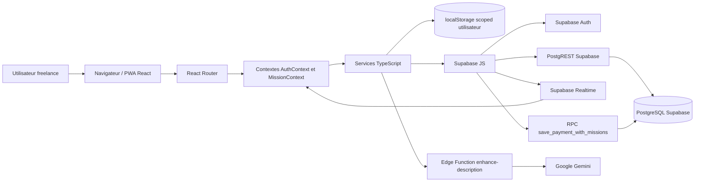
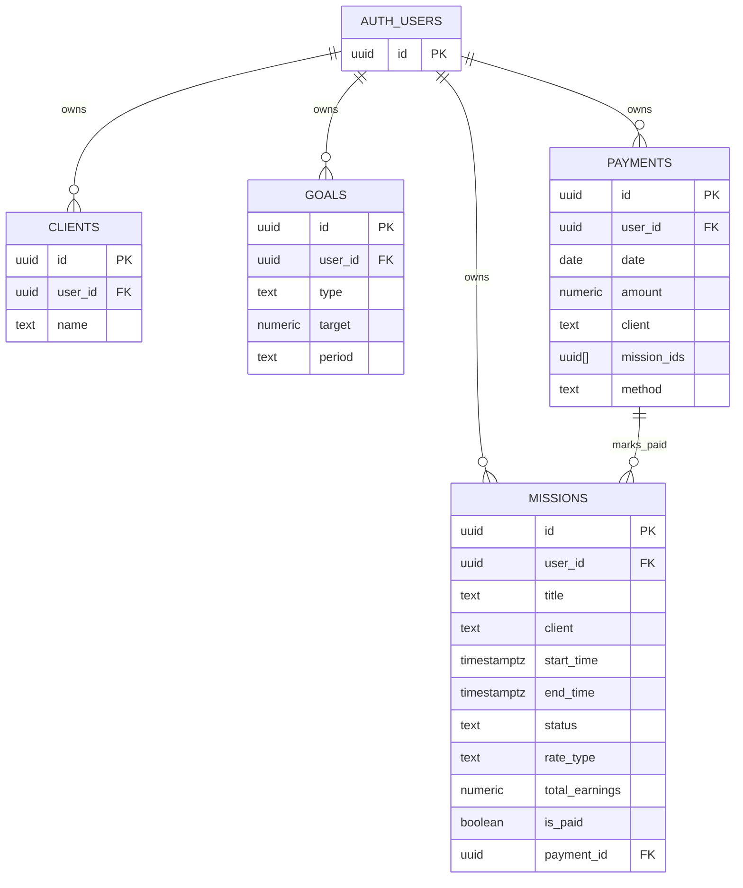

# Architecture système — NeuroTime

## Vue d'ensemble



Flux principal : le client React charge l'utilisateur via Supabase Auth, hydrate les données depuis Supabase puis maintient un cache local par utilisateur. Les mutations critiques sont optimistes côté UI, puis persistées dans Supabase avec RLS. Les changements distants sur missions et paiements sont reçus via Supabase Realtime.

---

## Frontend

### Organisation

- `src/index.tsx` monte l'application React avec `BrowserRouter`, `AuthProvider`, `MissionProvider` et `ErrorBoundary`.
- `src/App.tsx` gère le layout global, la sidebar desktop, la navigation mobile, le splash/loading et les routes.
- `src/components/` contient les vues principales : tableau de bord, liste des missions, formulaire de mission, paiements, statistiques, URSSAF, profil et authentification.
- `src/components/dashboard/` découpe le tableau de bord en cartes, listes et modales spécialisées.
- `src/hooks/` regroupe les hooks de statistiques, exports, préférences, confirmation et gestes tactiles.
- `src/services/` isole les accès à Supabase, au cache local, aux objectifs, clients, préférences et IA.
- `src/utils/` contient la logique métier testable : calculs horaires/revenus, validation, exports, retry et créneaux.

### Routing

Le routage est une SPA React Router avec chargement paresseux (`lazy` + `Suspense`) des vues principales.

| Route | Vue | Rôle |
|---|---|---|
| `/` | `Dashboard` | Synthèse d'activité, KPIs, objectifs, exports et historique. |
| `/missions` | `MissionsList` | Recherche, filtres, actions rapides et exports des missions. |
| `/payments` | `PaymentsView` | Création, consultation et suppression de paiements/virements. |
| `/stats` | `StatsView` | Visualisations et analyses des missions. |
| `/urssaf` | `UrssafView` | Simulation de cotisations sur revenus payés. |
| `/profile` | `ProfileView` | Préférences utilisateur et paramètres. |
| `*` | `Navigate` | Redirection vers `/`. |

### Gestion d'état

- `AuthContext` expose `user`, `loading` et `signOut` à partir de Supabase Auth.
- `MissionContext` centralise `missions`, `payments`, les états `isLoading` / `isSaving`, les mutations et les rafraîchissements.
- Les préférences UI sont stockées dans `localStorage` via `preferencesService` : masquage des prix, sidebar épinglée, tarifs jour/nuit.
- Les objectifs sont chargés et modifiés directement via `goalsService` depuis `DashboardGoals`.
- Les composants utilisent `useMemo` pour les agrégations et filtres coûteux.

### PWA

La configuration PWA est portée par `vite-plugin-pwa` :

- mode `standalone`, thème sombre et icônes dans `public/` ;
- mise à jour automatique du service worker ;
- raccourcis « Nouvelle mission » et « Tableau de bord » ;
- cache réseau désactivé pour Supabase (`NetworkOnly`) ;
- cache longue durée pour les polices Google ;
- cache `NetworkFirst` pour Nominatim/OpenStreetMap.

---

## Backend / API

NeuroTime n'a pas de serveur applicatif Node dédié dans le dépôt. Le backend est fourni par Supabase : Auth, API PostgREST, Realtime, RPC PostgreSQL et Edge Functions.

### Couches applicatives

```text
Composants React
└── Contextes React
    └── Services TypeScript
        ├── Supabase Auth
        ├── Supabase PostgREST
        ├── Supabase RPC
        ├── Supabase Realtime
        ├── Supabase Edge Function
        └── localStorage fallback
```

### Middlewares et sécurité

- La sécurité d'accès aux données est déléguée à Supabase Auth + Row Level Security.
- Chaque table métier possède une colonne `user_id` reliée à `auth.users(id)`.
- Les politiques RLS limitent la lecture, l'insertion, la mise à jour et la suppression à `auth.uid() = user_id`.
- Le frontend n'utilise que la clé publique `anon` Supabase.
- La clé Gemini a été retirée du bundle frontend ; l'appel IA passe par une Edge Function.

### Authentification

- Inscription : `supabase.auth.signUp({ email, password })`.
- Connexion : `supabase.auth.signInWithPassword({ email, password })`.
- Session courante : `supabase.auth.getUser()`.
- Déconnexion : `supabase.auth.signOut()`.
- Écoute session : `supabase.auth.onAuthStateChange(...)`.

---

## Base de données

### Modèle relationnel simplifié



### Stratégie de migration

- `supabase/migrations/20260529104354_remote_schema.sql` représente le schéma distant exporté.
- Les fichiers `supabase_setup*.sql` et `supabase_migration_*.sql` documentent des étapes historiques ou complémentaires.
- `neurotime_migration_correctifs.sql` renforce le schéma : `user_id NOT NULL`, table `payments`, FK `payment_id`, index, triggers et RPC transactionnelle.
- Les migrations sont SQL-first et doivent être appliquées via Supabase CLI ou SQL editor.

> ⚠️ À compléter : formaliser une seule source de vérité de migration. Plusieurs scripts SQL coexistent avec un export distant, ce qui peut créer des divergences si l'ordre d'application n'est pas documenté.

---

## Services externes

| Service | Rôle | Intégration détectée |
|---|---|---|
| Supabase Auth | Gestion des comptes et sessions | `@supabase/supabase-js` |
| Supabase PostgreSQL / PostgREST | Tables métiers et CRUD | `from(...).select/insert/upsert/update/delete` |
| Supabase Realtime | Synchronisation multi-appareil | Canaux `missions:user:<id>` et `payments:user:<id>` |
| Supabase RPC | Paiement atomique + statut missions | `save_payment_with_missions` |
| Supabase Edge Functions | Proxy sécurisé pour l'IA | `functions.invoke('enhance-description')` |
| Google Gemini | Amélioration de descriptions | Appelé côté Edge Function, pas directement dans le frontend |
| OpenStreetMap / Nominatim | Géocodage ou recherche d'adresse | Cache PWA configuré pour `nominatim.openstreetmap.org` |
| Vercel | Hébergement SPA | Rewrite `/(.*)` vers `/` |

---

## Décisions d'architecture

| Décision | Justification | Impact |
|---|---|---|
| SPA React + Vite | Démarrage rapide, bundle moderne, DX simple. | Application client-first sans serveur Node. |
| Supabase comme backend | Auth, Postgres, RLS, Realtime et Edge Functions disponibles sans backend dédié. | Moins d'infrastructure à maintenir, forte dépendance à Supabase. |
| RLS par `user_id` | Isolation stricte des données utilisateur. | Les requêtes frontend restent simples et sûres avec la clé `anon`. |
| Contextes React | Centraliser auth, missions et paiements sans state manager lourd. | Suffisant pour le périmètre actuel ; surveiller la complexité si les domaines augmentent. |
| Mutations optimistes | UI réactive et tolérante à la latence réseau. | Requiert rollback ou notifications en cas d'échec distant. |
| Cache `localStorage` scoped | Continuité d'accès en cas d'erreur réseau et isolation par utilisateur/environnement. | Ne remplace pas une vraie stratégie offline-first. |
| RPC SQL pour paiements | Assure la cohérence entre paiement créé et missions marquées payées. | Logique métier critique côté base. |
| IA via Edge Function | Empêche l'exposition d'une clé Gemini dans le navigateur. | Nécessite déploiement et secrets Supabase séparés. |
| PWA | Usage mobile et desktop installable. | Attention au cache : Supabase est explicitement en `NetworkOnly`. |
