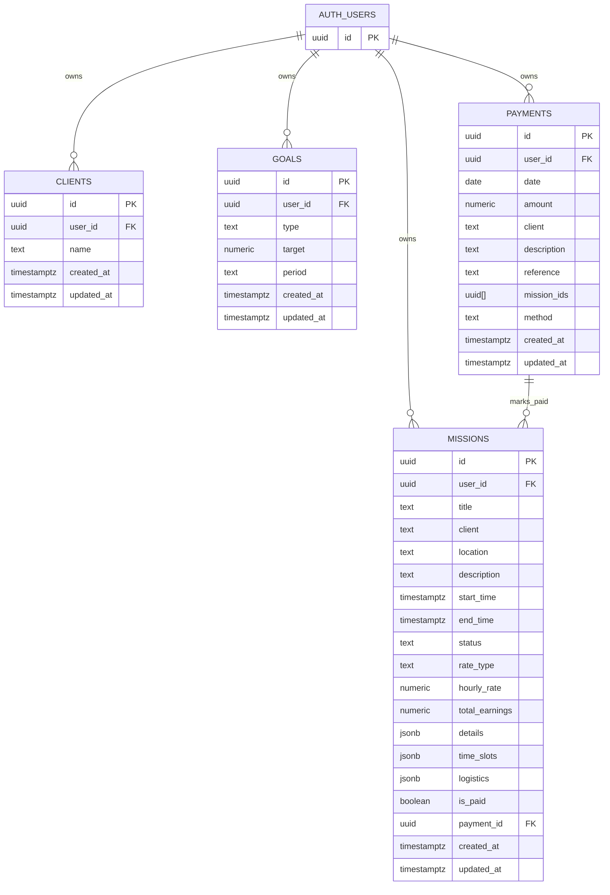

# Schéma de base de données — NeuroTime

La base de données détectée est Supabase PostgreSQL. Les tables métier principales sont `missions`, `clients`, `goals` et `payments`, toutes rattachées à `auth.users` via `user_id` et protégées par RLS.

> ⚠️ À compléter : plusieurs scripts SQL historiques coexistent avec l'export `supabase/migrations/20260529104354_remote_schema.sql`. Cette documentation décrit le schéma consolidé détecté, mais une migration canonique unique devrait être désignée.

---

## Table `missions`

### Description fonctionnelle

Stocke les missions planifiées, terminées ou annulées d'un utilisateur : client, lieu, horaires, tarifs, revenus calculés, créneaux multiples, statut de paiement et rattachement éventuel à un paiement.

### Colonnes

| Colonne | Type | Contraintes | Description |
|---|---|---|---|
| `id` | `uuid` | PK, défaut `gen_random_uuid()` | Identifiant de mission. |
| `user_id` | `uuid` | NOT NULL, FK `auth.users(id)` ON DELETE CASCADE | Propriétaire de la mission. |
| `title` | `text` | NOT NULL | Titre. |
| `client` | `text` | Nullable | Nom du client. |
| `location` | `text` | NOT NULL | Lieu de mission. |
| `description` | `text` | Nullable | Description libre. |
| `start_time` | `timestamptz` | NOT NULL | Date/heure de début principale. |
| `end_time` | `timestamptz` | NOT NULL, CHECK `end_time > start_time` | Date/heure de fin principale. |
| `status` | `text` | NOT NULL, CHECK `planned`, `completed`, `cancelled` | Statut métier. |
| `rate_type` | `text` | NOT NULL, CHECK `day`, `night`, `mixed`, `custom` | Type de tarification. |
| `hourly_rate` | `numeric(10,2)` | Défaut `0` | Taux horaire indicatif ou personnalisé. |
| `total_earnings` | `numeric(10,2)` | Défaut `0` | Revenu calculé total. |
| `details` | `jsonb` | Nullable | Détail de calcul, par exemple heures jour/nuit. |
| `created_at` | `timestamptz` | Défaut `now()` | Date de création. |
| `updated_at` | `timestamptz` | Défaut `now()`, trigger update | Date de dernière modification. |
| `time_slots` | `jsonb` | Nullable | Liste de créneaux `{ startTime, endTime }` pour une même journée. |
| `logistics` | `jsonb` | Nullable si migration appliquée | Horaires logistiques livraison/récupération. |
| `is_paid` | `boolean` | Défaut `false` | Indique si la mission est réglée. |
| `payment_id` | `uuid` | FK `payments(id)` ON DELETE SET NULL, nullable | Paiement associé. |

### Relations

| Relation | Cardinalité | Description |
|---|---|---|
| `auth.users.id` → `missions.user_id` | 1 → N | Un utilisateur possède plusieurs missions. |
| `payments.id` → `missions.payment_id` | 1 → N | Un paiement peut marquer plusieurs missions comme payées. |

### Index notables

| Index | Colonnes | Rôle |
|---|---|---|
| `idx_missions_user_id` | `user_id` | Filtrage utilisateur. |
| `idx_missions_start_time` | `start_time DESC` | Tri chronologique global. |
| `idx_missions_user_start_time` | `user_id`, `start_time DESC` | Chargement des missions utilisateur triées. |
| `idx_missions_status` | `status` | Filtres par statut. |
| `idx_missions_is_paid` | `is_paid` | Filtres payé/impayé. |
| `idx_missions_user_status_paid` | `user_id`, `status`, `is_paid` | Vues filtrées utilisateur. |
| `idx_missions_payment_id` | `payment_id` | Jointure paiement → missions. |
| `idx_missions_user_payment` | `user_id`, `payment_id` | Recherche des missions d'un paiement par utilisateur. |

### Politiques RLS

RLS est activée. Les politiques détectées autorisent uniquement l'utilisateur propriétaire :

| Politique | Opération | Condition |
|---|---|---|
| `Users can view own missions` | SELECT | `auth.uid() = user_id` |
| `Users can insert own missions` | INSERT | `auth.uid() = user_id` |
| `Users can update own missions` | UPDATE | `auth.uid() = user_id` |
| `Users can delete own missions` | DELETE | `auth.uid() = user_id` |

---

## Table `clients`

### Description fonctionnelle

Stocke les clients de l'utilisateur pour faciliter la saisie, le filtrage et la synchronisation depuis les missions existantes.

### Colonnes

| Colonne | Type | Contraintes | Description |
|---|---|---|---|
| `id` | `uuid` | PK, défaut `gen_random_uuid()` | Identifiant client. |
| `user_id` | `uuid` | NOT NULL, FK `auth.users(id)` ON DELETE CASCADE | Propriétaire du client. |
| `name` | `text` | NOT NULL | Nom du client. |
| `created_at` | `timestamptz` | Défaut `now()` | Date de création. |
| `updated_at` | `timestamptz` | Défaut `now()`, trigger update | Date de dernière modification. |

### Relations

| Relation | Cardinalité | Description |
|---|---|---|
| `auth.users.id` → `clients.user_id` | 1 → N | Un utilisateur possède plusieurs clients. |

> Note : aucune clé étrangère stricte ne relie `missions.client` à `clients.id`. Le lien est textuel par nom de client.

### Index notables

| Index | Colonnes | Rôle |
|---|---|---|
| `idx_clients_user_id` | `user_id` | Filtrage utilisateur. |
| `idx_clients_name` | `name` | Recherche/tri par nom. |
| `idx_clients_user_name_unique` | `user_id`, `lower(name)` | Empêche les doublons insensibles à la casse par utilisateur. |

### Politiques RLS

| Politique | Opération | Condition |
|---|---|---|
| `Users can view own clients` | SELECT | `auth.uid() = user_id` |
| `Users can insert own clients` | INSERT | `auth.uid() = user_id` |
| `Users can update own clients` | UPDATE | `auth.uid() = user_id` |
| `Users can delete own clients` | DELETE | `auth.uid() = user_id` |

---

## Table `goals`

### Description fonctionnelle

Stocke les objectifs utilisateur : chiffre d'affaires, nombre de missions ou heures, avec une période mensuelle ou annuelle.

### Colonnes

| Colonne | Type | Contraintes | Description |
|---|---|---|---|
| `id` | `uuid` | PK, défaut `gen_random_uuid()` | Identifiant objectif. |
| `user_id` | `uuid` | NOT NULL, FK `auth.users(id)` ON DELETE CASCADE | Propriétaire. |
| `type` | `text` | NOT NULL, CHECK `revenue`, `missions`, `hours` | Type d'objectif. |
| `target` | `numeric(10,2)` | NOT NULL | Valeur cible. |
| `period` | `text` | NOT NULL, CHECK `month`, `year` | Période de suivi. |
| `created_at` | `timestamptz` | Défaut `now()` | Date de création. |
| `updated_at` | `timestamptz` | Défaut `now()`, trigger update | Date de dernière modification. |

### Relations

| Relation | Cardinalité | Description |
|---|---|---|
| `auth.users.id` → `goals.user_id` | 1 → N | Un utilisateur possède plusieurs objectifs. |

### Index et contraintes notables

| Nom | Colonnes | Rôle |
|---|---|---|
| `goals_user_id_type_period_key` / `goals_user_type_period_unique` | `user_id`, `type`, `period` | Un seul objectif par type/période/utilisateur. |
| `idx_goals_user_id` | `user_id` | Filtrage utilisateur. |
| `idx_goals_user_type_period` | `user_id`, `type`, `period` | Recherche rapide d'objectif métier. |

### Politiques RLS

| Politique | Opération | Condition |
|---|---|---|
| `Users can view own goals` | SELECT | `auth.uid() = user_id` |
| `Users can insert own goals` | INSERT | `auth.uid() = user_id` |
| `Users can update own goals` | UPDATE | `auth.uid() = user_id` |
| `Users can delete own goals` | DELETE | `auth.uid() = user_id` |

---

## Table `payments`

### Description fonctionnelle

Stocke les paiements ou virements reçus, avec montant, client, référence, méthode et liste des missions associées. La RPC `save_payment_with_missions` insère/met à jour le paiement et marque les missions correspondantes comme payées.

### Colonnes

| Colonne | Type | Contraintes | Description |
|---|---|---|---|
| `id` | `uuid` | PK | Identifiant paiement. |
| `user_id` | `uuid` | NOT NULL, FK `auth.users(id)` ON DELETE CASCADE | Propriétaire. |
| `date` | `date` | NOT NULL | Date du paiement. |
| `amount` | `numeric(12,2)` ou `numeric(10,2)` selon script | NOT NULL, défaut `0`, CHECK `amount >= 0` dans certains scripts | Montant reçu. |
| `client` | `text` | NOT NULL | Client concerné. |
| `description` | `text` | Nullable | Description. |
| `reference` | `text` | Nullable | Référence de virement ou suivi. |
| `mission_ids` | `uuid[]` | Défaut `{}` | Liste des missions rattachées. |
| `method` | `text` | Défaut `virement`, CHECK `virement`, `cash`, `check`, `other` dans certains scripts | Moyen de paiement. |
| `created_at` | `timestamptz` | Défaut `now()` | Date de création. |
| `updated_at` | `timestamptz` | Présente dans scripts correctifs, trigger update | Date de dernière modification. |

> ⚠️ À compléter : l'export distant et les scripts correctifs ne décrivent pas exactement les mêmes contraintes pour `payments.amount`, `payments.method` et `payments.updated_at`. Aligner la migration canonique avant production.

### Relations

| Relation | Cardinalité | Description |
|---|---|---|
| `auth.users.id` → `payments.user_id` | 1 → N | Un utilisateur possède plusieurs paiements. |
| `payments.id` → `missions.payment_id` | 1 → N | Un paiement peut être lié à plusieurs missions. |
| `payments.mission_ids` | N/A | Liste dénormalisée d'UUID de missions utilisée par la RPC et l'UI. |

### Index notables

| Index | Colonnes | Rôle |
|---|---|---|
| `idx_payments_user_date` | `user_id`, `date DESC` | Chargement des paiements utilisateur triés. |
| `idx_payments_user_id` | `user_id` | Filtrage utilisateur. |
| `idx_payments_user_client` | `user_id`, `client` | Recherche par client. |

### Politiques RLS

| Politique | Opération | Condition |
|---|---|---|
| `Users can view own payments` | SELECT | `auth.uid() = user_id` |
| `Users can insert own payments` | INSERT | `auth.uid() = user_id` |
| `Users can update own payments` | UPDATE | `auth.uid() = user_id` |
| `Users can delete own payments` | DELETE | `auth.uid() = user_id` |
| `Users can manage own payments` | ALL | `auth.uid() = user_id` |
| `Users can manage their own payments` | ALL authenticated | `auth.uid() = user_id` |

> Note : plusieurs politiques de gestion des paiements sont redondantes. Cela fonctionne, mais devrait être simplifié pour faciliter les audits.

---

## Fonctions et triggers

| Nom | Type | Description |
|---|---|---|
| `update_updated_at_column()` | Trigger function | Définit `NEW.updated_at = now()` avant update. |
| `save_payment_with_missions(payment_payload jsonb)` | RPC | Upsert un paiement depuis le payload frontend, puis met à jour les missions associées avec `payment_id` et `is_paid = true`. |
| `save_payment_with_missions(p_payment_id, p_user_id, ...)` | RPC alternative | Variante paramétrée avec vérification `auth.uid() = p_user_id`. |

Triggers détectés :

| Trigger | Table | Moment | Fonction |
|---|---|---|---|
| `update_missions_updated_at` / `trigger_missions_updated_at` | `missions` | BEFORE UPDATE | `update_updated_at_column()` |
| `update_clients_updated_at` | `clients` | BEFORE UPDATE | `update_updated_at_column()` |
| `update_goals_updated_at` | `goals` | BEFORE UPDATE | `update_updated_at_column()` |
| `update_payments_updated_at` / `trigger_payments_updated_at` | `payments` | BEFORE UPDATE | `update_updated_at_column()` |

---

## Diagramme Mermaid ERD

